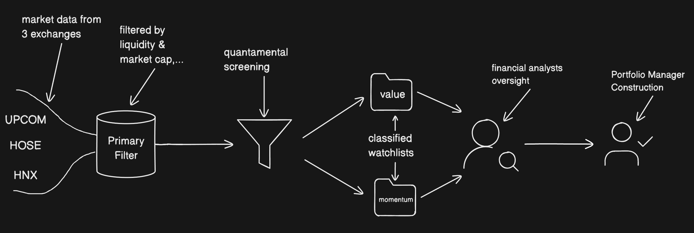
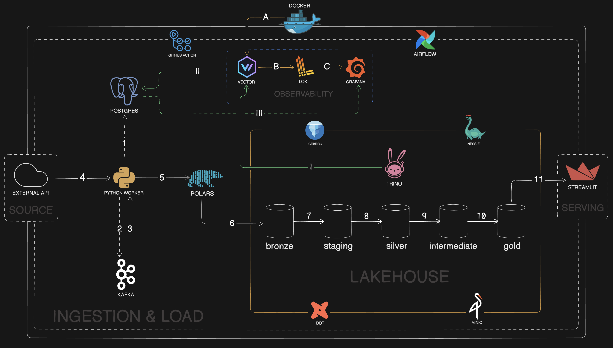
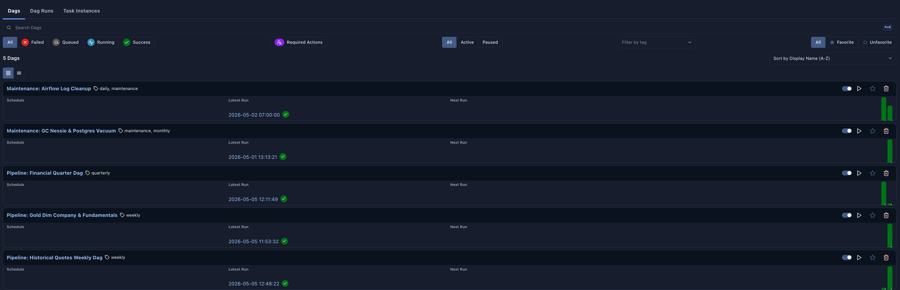
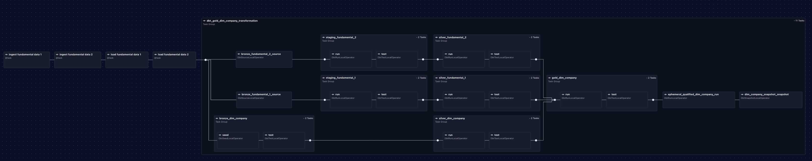
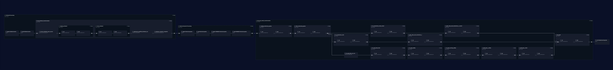
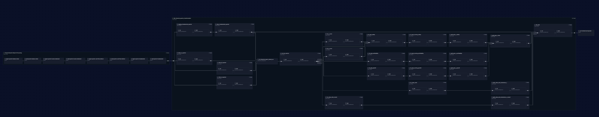
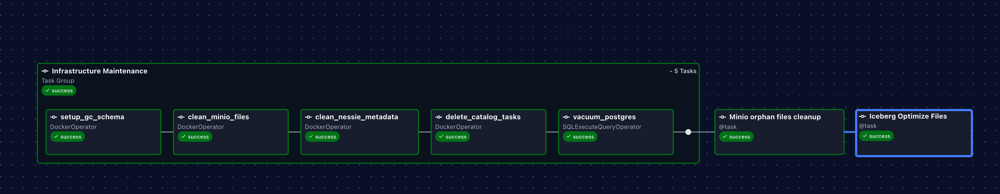
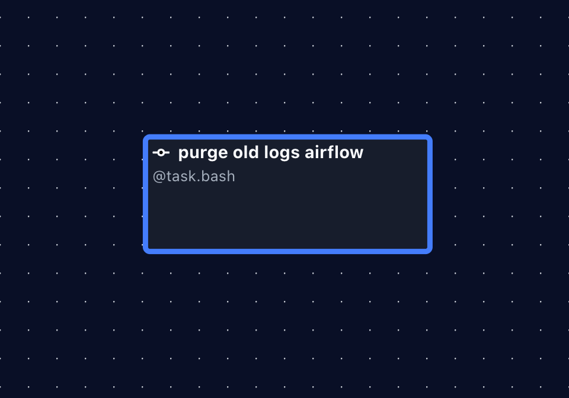

# Quantamental Factor Screener: An Automated Financial Data Platform
## The Real Problem: It's About time, not data
The biggest pain in long-term investing is **NOT** a lack of data. It is **NOT** a lack of valuation methods or formulas.

The true pain point is the **MASSIVE AMOUNT OF TIME** wasted on manual work.

Hand-picking and analyzing individual companies across a market of 1,600+ stocks takes **WEEKS, EVEN MONTHS**. You can spend days digging through financial statements and calculating ratios in Excel, only to realize the company is fundamentally weaked. All that time and effort are completely wasted.

## Solution: Automating the Heavy Lifting
This platform was built to solve that exact pain point. By automating the data engineering pipeline, it **SAVES 90% OF YOUR RESEARCH TIME**. It acts as an automated screener that instantly narrows down the entire market by answering three core questions in a sequential pipeline:

*   **1. "Is this a fundamentally strong business?" (Solved by Quality - [QMJ Score](https://link.springer.com/article/10.1007/s11142-018-9470-2)):**
    *   **The Pain:** Spending days manually reading through hundreds of financial reports, struggling to find a few truly high-quality companies among thousands of options.
    *   **The Solution:** The QMJ score is your **AUTOMATED QUALITY SCREENER**. It objectively evaluates financial health and hands you a watchlist of ONLY the safest, most profitable, and consistently growing companies. This forms the foundation of your research.

*   **2. "Is the price fair?" (Solved by [Value Score](https://papers.ssrn.com/sol3/papers.cfm?abstract_id=2174501)):**
    *   **The Pain:** Spending hours building complex valuation models, only to find out a quality stock is currently too expensive.
    *   **The Solution:** Building on top of your QMJ-approved list, the Value score instantly scans your pre-filtered high-quality companies and highlights which ones are currently undervalued, ensuring you never overpay for a good asset.

*   **3. "Is it time to act?" (Solved by [Momentum Score](https://papers.ssrn.com/sol3/papers.cfm?abstract_id=2174501)):**
    *   **The Pain:** Buying a great, undervalued stock, but waiting years for the price to move because the broader market is ignoring it.
    *   **The Solution:** The Momentum score **TRACKS THE TREND**. As the final overlay, it shows you exactly which of those high-quality stocks are attracting cash flow *right now*, helping you optimize your entry timing.

    

## ⚠️ Limitations: The Irreplaceable Human Element

While this platform successfully automates data collection and screening, it is a **tool to help make decisions, not a replacement for human experts**.

Here is what this platform *cannot* replace:

*   **Data Imperfections:** Automated systems rely on raw data, which can sometimes have reporting errors or missing numbers. The screened list is just step one, not the final answer.
*   **Deep Fundamental Analysis:** The system calculates past and present numbers perfectly, but it cannot predict the future. We still absolutely need Financial Analysts to dig deep into a company's real-world business model, competitive advantages, and true future potential.
*   **Strategic Portfolio Management:** A list of good stocks doesn't automatically create a safe portfolio. We still need Investment Strategists to set the big-picture goals, and Portfolio Managers to build a balanced portfolio and track long-term growth.
*   **Asset Diversification:** This platform focuses only on stocks. A solid investment plan needs diversification across other asset classes like bonds, real estate, or commodities.

> *No matter how smart the machine gets, it cannot replace finance professionals. Technology just takes away the manual, repetitive work. This gives human analysts more time and energy to focus on what they do best: thinking, planning, and making real strategies.*

## See It In Action (Live Demo)

All the heavy data processing from the pipeline is served directly to a live, interactive dashboard. You can jump right in to see how the system automatically ranks and filters the market.

👉 **[CLICK HERE TO EXPLORE THE LIVE QUANTAMENTAL SCREENER](https://qmj-dashboard.streamlit.app/)** 👈
> **Note on "Cold Start":** Since this is a community-hosted app, it may go into "sleep mode" if inactive. If the page doesn't load immediately, please **click the "Wake up" button and wait about 30 seconds** for the system to boot up.

*(Tip: Once inside, please select the **Q4/2025** reporting period—since many companies haven't released their Q1/2026 financial reports yet. Then, filter by "Hạng QMJ" to instantly see the top fundamentally strong companies in the market).*

---
*Alright folks! let's move to the data platform architecture to clearly see the engine under the hood*
# System Architecture

> *An end-to-end event-driven Data Lakehouse architecture: from raw financial API ingestion via Kafka & Polars, through a 5-tier Medallion transformation pipeline (dbt, Apache Iceberg, Trino), fully orchestrated by Airflow and monitored by a centralized Observability stack.*

## Data flows explanation
### The Core Data Pipeline (Flows 1 - 11)
This is the main flow of the financial data, from raw API extraction to the user's serving layer.

* **[1] State-Driven Task Generation:** The Python Worker queries two PostgreSQL tables to safely orchestrate the ingestion. First, it reads the `ingestion_watermark` table to check the latest ingestion status of specific data types for each stock ticker. Based on this state, it constructs task payloads (JSONs containing API URLs, fetch dates, Airflow IDs, data types,...). Then, it checks the `ingestion_kafka_state` table to ensure these specific tasks haven't already been queued, guaranteeing idempotence and preventing duplicate API calls.
* **[2 & 3] The Claim-Check Pattern via Kafka:** To prevent overloading the message broker, the system implements the Claim-Check Pattern. Instead of putting heavy raw data through Kafka, it only pushes lightweight "claim checks" (the task JSONs) as events [2]. A separate consumer worker pulls these claim checks from Kafka [3], using the metadata instructions to fetch the actual heavy data directly from the source. This keeps the Kafka event stream lightning-fast and highly scalable.
* **[4] API Extraction via Micro-Batching:** Triggered by the claim-check messages, the consumer Python Workers execute the requests to the External APIs. To prevent Out-Of-Memory (OOM) when dealing with massive financial data payloads, the extraction isexecuted in micro-batches (small, manageable chunks) rather than pulling everything into RAM at once.
* **[5] In-Memory Processing (Powered by Rust):** These micro-batches are handed over to Polars. Because Polars is written in Rust, it is super fast, and can easily handles heavy data loads that would typically choke Pandas. Polars ensures the ingestion pipeline runs smoothly and remains completely bottleneck-free.
* **[6] Fault-Tolerant Loading & Offset Acknowledgment:** Polars writes the processed chunks directly into the Bronze Layer of the Lakehouse (stored in MinIO as Iceberg tables). Crucially, the Kafka consumer only commits the offset (flushes the message) AFTER a successful write to the Bronze layer to prevent data loss during a mid-process crash.
* **[7, 8, 9, 10] dbt Medallion Pipeline:** dbt handles the heavy lifting, transforming raw data through 5 strict layers (Bronze ➔ Staging ➔ Silver ➔ Intermediate ➔ Gold). It standardizes schemas, calculates complex financial metrics, and finally merges everything into a "One Big Table" (OBT). This eliminates the need for complex CPU-heavy SQL joins, ensures fast dashboard performance and reduce computing cost.
* **[11] Cost-Optimized Serving:** Hosting a server for a portfolio project is over-engineer and expensive. Embracing a pragmatic engineering approach, the final Gold layer is extracted as a CSV file. This file is directly served via Streamlit Cloudzero hosting costs.

### Centralized Observability (Flows A - C)
Monitoring a distributed data platform with 9 moving parts can be really hard if done manually. Instead of opening terminal and typing `docker logs <container_name>` to debug, this architecture implements a centralized observability stack.

* **[A] Daemon-Level Log interception:** Vector is deployed with a bind mount directly to the Docker daemon socket (`unix:///var/run/docker.sock`). Vector can automatically capture the log streams from ALL 9 containers in the cluster simultaneously.
* **[B] Resilient Processing & Routing:** Vector takes the raw logs and encodes the payloads into structured **JSON**.
* **[C] The Single Pane of Glass:** The structured logs are pushed to Loki (the log aggregation engine) and immediately available in Grafana. Because Vector pre-encoded everything into JSON, Grafana's built-in parsers can read, filter on specific fields. The entire platform's health is now monitored from one unified interface.

### FinOps & Long-Term Query Auditing (Flows I - III)
Running a distributed SQL engine like Trino can be expensive if users write poorly optimized queries. To enforce **FinOps** (Cloud Cost Optimization), the platform implements a query telemetry pipeline.

* **[I] Query Telemetry Interception:** Trino is configured with an event listener that emits metadata for every executed query. Vector captures these JSON payloads via an HTTP server source (`trino_http_listener`).
* **[II] VRL Processing & Long-Term Storage:** Inside Vector, the VRL engine processes the raw event. It extracts user info, the cleaned SQL query text, and crucial **FinOps metrics** (`cpu_time_s`, `scanned_bytes`, `peak_memory_bytes`). Then Vector routes these structured audit logs into a dedicated **PostgreSQL** database for long-term storage.
* **[III] The FinOps Dashboard:** **Grafana** connects directly to this PostgreSQL audit database to visualize compute costs. This creates a powerful FinOps dashboard that highlights the most CPU-intensive queries, tracks data scanned over time. It allows the data team to pinpoint exact queries that need optimization, reducing compute overhead and reduce computing costs.

## Day 2 Operations & Platform Engineering
### The Orchestrator: Airflow
To optimize API usage and compute costs, the orchestration is separated into three distinct DAGs based on the data's natural update frequency.

To handle the dbt transformation layer, I replaced the native Airflow `BashOperator` with Astronomer Cosmos. Instead of running a single monolithic `dbt run` command, Cosmos renders every dbt model as a standalone Airflow task. This makes debugging effortless and allows me to clear and re-run specific failed tasks without restarting the entire pipeline.

> *Overview of the Airflow UI: Managing ingestion schedules, transformation pipelines and maintenance jobs.*

#### Group 1: The Core Data Pipelines

> **`DAG: Gold Dim Company & Fundamentals`**
> * **Frequency:** Monthly.
> * **The Logic:** This pipeline ingests baseline metadata for 1,500+ stocks, including exchange info, market capitalization, and average liquidity,...
> * **dbt Action:** Cosmos triggers dbt models to apply direct business filters (e.g., removing illiquid or penny stocks). It outputs the `gold_dim_company`, which is a clean, qualified list of companies that serves as the foundation for all subsequent calculations.

> **`DAG: Historical Quotes Weekly Dag`**
> * **Frequency:** Weekly.
> * **The Logic:** This pipeline updates market prices and monitors dividend payouts using SCD Type 2 (dbt Snapshots).
>   * *If a dividend change is detected:* It triggers a full historical backfill to adjust past prices for that specific ticker.
>   * *If no change:* It simply performs a lightweight, incremental load for the new trading days.
> * **dbt Action:** dbt models use this clean price data to calculate the Value Score and Momentum Score.

> **`DAG: Financial Quarter Dag`**
> * **Frequency:** Every 3.5 - 4 months (aligned with financial reporting periods).
> * **The Logic:** This pipeline pulls the full financial statements (Balance Sheet, Income Statement, Cash Flow, and fundamental metrics) for the filtered companies.
> * **dbt Action:** The dbt pipeline calculates the exact math required to output the final Quality (QMJ) Score.

#### Group 2: Automated System Maintenance

A true production-grade Lakehouse must maintain itself. To prevent storage bloat and performance degradation over time, this monthly maintenance DAG automates the cleanup and compaction process:

> * **Nessie GC & Database Vacuum:** It executes Nessie's Garbage Collection CLI to purge expired Iceberg snapshots and unreferenced metadata commits, followed by a `VACUUM ANALYZE` on PostgreSQL to reclaim disk space.
> * **MinIO Orphan Cleanup:** It compares the physical data files in MinIO against the active "live set" managed by Nessie. Any untracked physical files are permanently deleted.
> * **Iceberg Optimization:** It triggers Trino to compact scattered, small Parquet files into larger chunks and rewrites the Iceberg manifest files, preventing the "small files problem" and ensuring fast read speeds.
> * **Architecture Note (Avoiding Docker-in-Docker):** To execute the Nessie CLI tools, I avoided using `BashOperator` to run container commands inside the Airflow worker. That creates a "Docker-in-Docker" (DinD) pattern, which makes debugging really difficult. Instead, I used `DockerOperator`. This safely creates temporary sibling containers directly on the host machine, keeping the Airflow environment clean and isolated.

> * **Airflow Log Purge:** Airflow generates massive logs for every single task. A dedicated  DAG runs a simple bash script to purge all local Airflow logs older than 3 days, ensuring the host machine never runs out of storage.

### The Open Data Lakehouse

As a Finance student building a portfolio project, my core philosophy is tied to **ROI (Return on Investment) and FinOps**. While traditional cloud Data Warehouses (like Snowflake or BigQuery) are powerful, they are quite expensive for a student, especially when dealing with growing financial datasets.

Therefore, I deliberately designed a Decoupled Open Data Lakehouse. This architecture strictly separates storage from compute, allowing each layer to scale independently based on actual demand:

* **Storage (MinIO) & Format (Apache Iceberg):** MinIO acts as the S3-compatible object storage, providing infinite scalability at a low cost. On top of that, Apache Iceberg manages the raw Parquet files and brings crucial database features to the data lake:
  * **Zero Vendor Lock-in:** The data is stored in open-source formats. You are not trapped in a closed ecosystem like Snowflake. If you want to switch from Trino to Spark tomorrow, you just point the new engine to MinIO—no data migration needed.
  * **Schema Evolution:** You can add, drop, or rename columns instantly without having to rewrite terabytes of historical data.
  * **ACID Transactions:** Multiple pipelines can read and write to the same table simultaneously without causing data corruption or reading partial updates.
  * **Time Travel:** You can query the table exactly as it looked at a specific timestamp in the past. This is critical for debugging pipelines and reproducing old financial models.
* **The Catalog (Project Nessie):** Acting as the "Git-for-Data". Nessie allows me to create data branches to test heavy dbt transformations in isolation, and safely merge them into the production branch.
* **The Compute Engine Selection (Trino):**
  * **Why not Apache Spark?** Spark has high memory overhead (due to the JVM) and slow startup times. Since my dbt transformations are entirely SQL-based, deploying a heavy distributed processing framework like Spark consumes unnecessary RAM and compute costs.
  * **Why not DuckDB?** DuckDB is highly optimized for single-node, local analysis. However, it is not designed to be a distributed engine for production environments. Furthermore, its integration with Project Nessie and dbt is still experimental and prone to compatibility errors.
  * **Why not ClickHouse or StarRocks?** These OLAP engines are built for sub-second, real-time analytics. My financial pipelines update on weekly and monthly schedules. Real-time latency is not a business requirement, so adding these engines would only overcomplicate the infrastructure.
  * **Why Trino?** Trino is a Massively Parallel Processing engine that executes distributed SQL queries quickly without the heavy baseline RAM usage of Spark. It provides stable, native integration with Iceberg and Nessie. It also acts as the primary SQL engine for dbt and allows Grafana to read data directly from the Lakehouse.
---
